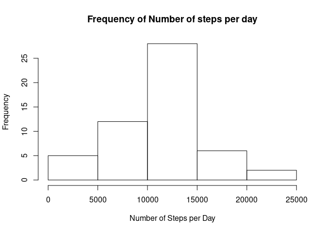
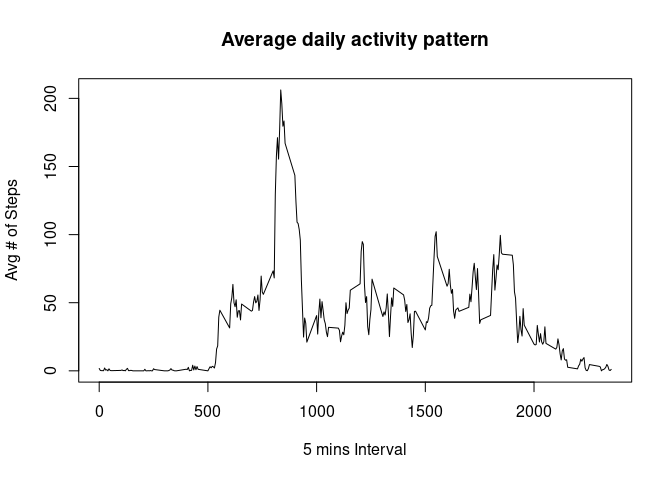
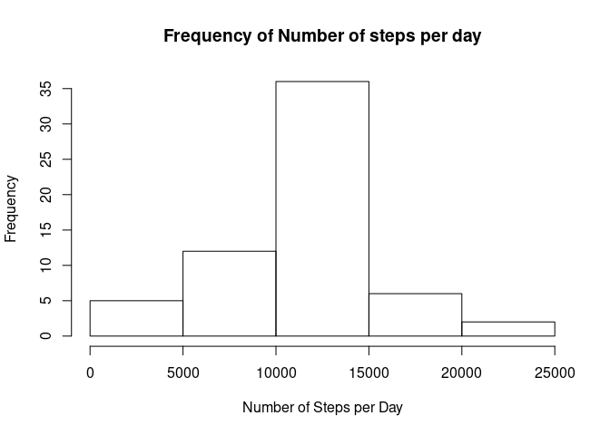
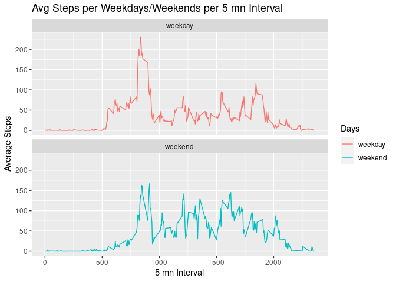

## Loading and preprocessing the data


## What is mean total number of steps taken per day?
<!-- -->

```
## [1] "Mean:  10766.1886792453  / Median:  10765"
```

## What is the average daily activity pattern?
<!-- -->

** There is clearly a peak of activity around mid day**

## Imputing missing values

```
## [1] "Number of NAs: 2304"
```

<!-- -->

```
## [1] "Mean:  10766.1886792453  / Median:  10766.1886792453"
```
**We see that replacing NA in the the "steps" column by the mean of steps per 5mn interval does not impact the overall mean, as expected. However, the median, which was very close to the mean in the initial Dataframe, now is equal to the mean...**

## Are there differences in activity patterns between weekdays and weekends?

```
## `summarise()` has grouped output by 'dayOfWeek'. You can override using the `.groups` argument.
```

<!-- -->

**There are differences: the average number of steps during weekends is slightly lower at mid-day and higher of about 100 steps in the afternoon, per interval of 5 minutes.**
